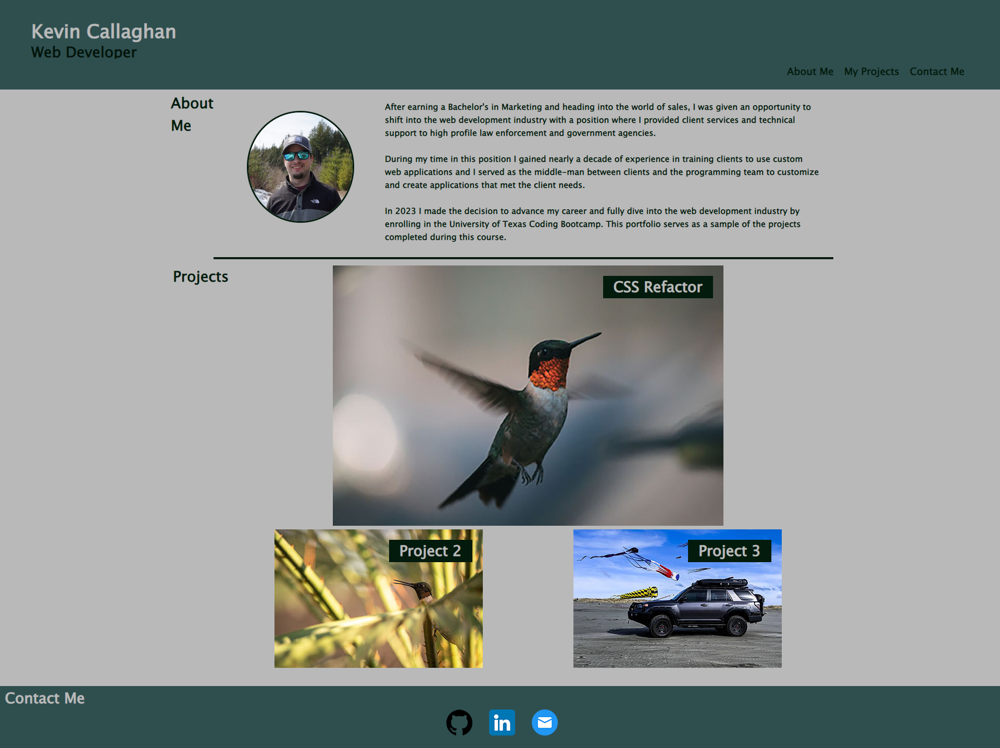

# Advanced CSS Portfolio

## Description

This Portfolio Page was created as an area for me to display completed programming applications to prospective employers who need to see a sample of the work I can create to determine wether to offer me an interview or position of employment.  It will give a picture and professional background to help the reader get to know a little about me before viewing the work I have completed.  At the end of the page you will find links to different methods of contact.  By building this page from scratch, the process really helped me get a better grasp of using flex-boxes to arrange the objects inside a container on the page in a way that presents itself well on both computers and smaller-screen devices such as tablet or mobile.  

## Table of Contents (Optional)

If your README is long, add a table of contents to make it easy for users to find what they need.

- [Usage](#usage)
- [Credits](#credits)
- [License](#license)

## Usage

This page is designed for a visitor to get an introduction to the developer and sample some of the projects completed during the coding bootcamp.  The Nav buttons will take the user to the correct area of the page, the images will link to the associated samples/projects, and the contact icons will link to the associated accounts.  This page will wrap to fit the screen as the width gets smaller between desktop, tablet, and mobile displays.  Click here to visit the deployed page: https://kevincallaghan.github.io/Advanced-CSS-Portfolio/ 

## Credits

For the text-overlay on the Project Images, I used CSS from w3schools.com.  The CSS was found on the "How To - Text Blocks Over Image" page: https://www.w3schools.com/howto/howto_css_image_text_blocks.asp 

I used a README template found on coding-boot-camp.github.io at: https://coding-boot-camp.github.io/full-stack/github/professional-readme-guide 

I used css-tricks.com's article titled "A Complete Guide to Flexbox" by Chris Coyier to help with my flexbox CSS.  The article is found here: https://css-tricks.com/snippets/css/a-guide-to-flexbox/ 

The Contact Icons for Github, Linkedin, and Email were downloaded from https://www.flaticon.com/

## License

Please refer to the LICENSE document in the Repository for License information.